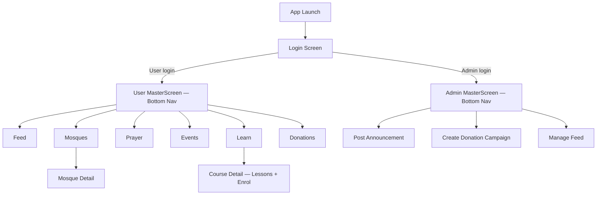
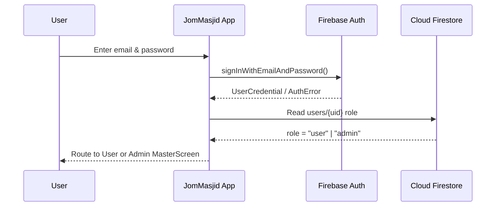
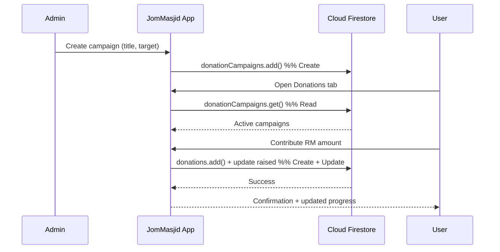
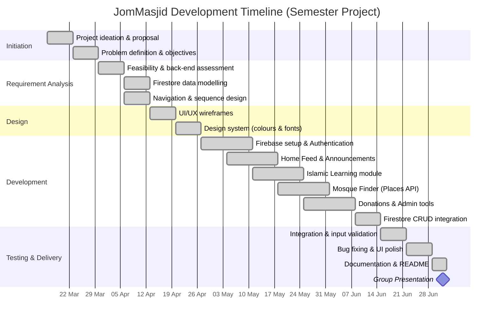

# JomMasjid — Islamic Community Mobile Application

> A Flutter-based Islamic community app that connects Muslims with their local
> mosques, community announcements, donation campaigns, and Islamic learning —
> powered by Firebase authentication and cloud storage.

**Course:** CSCI 4311 — Mobile Application Development
**Submission:** Group Project (Flutter + Firebase)

---

## 1. Group Information

| Field | Details |
|-------|---------|
| **Group Name** | `Fah` |
| **Repository** | `[Public GitHub Repository URL]` |
| **Platform** | Android (Flutter) |
| **Back End as a Service** | Firebase (Authentication + Cloud Firestore) |

### 1.1 Group Members & Task Assignment

Work is divided **evenly by module**, with each member owning one screen module
end-to-end (UI, state management, and Firebase integration) plus a shared
responsibility. Adjust names, matric numbers, and the split to match your group.

| No. | Name | Matric No. | Assigned Module / Tasks |
|-----|------|-----------|--------------------------|
| 1 | `[Member 1 — Leader]` | `[Matric No.]` | Authentication & Login (`login_screen.dart`), User/Admin routing, GitHub repo & merge management |
| 2 | `[Member 2]` | `[Matric No.]` | Home Feed & Announcements (`feed.dart`, `admin_announcement.dart`) |
| 3 | `[Member 3]` | `[Matric No.]` | Islamic Learning module (`learn.dart`) — courses, enrollment |
| 4 | `[Member 4]` | `[Matric No.]` | Mosque Finder (`mosques.dart`) — Google Places API integration |
| 5 | `[Member 5]` | `[Matric No.]` | Donation module (`donation_screen.dart`, `admin_donation_screen.dart`) |


---

## 2. Project Ideation & Initiation

### 2.1 Title
**JomMasjid** — *"Jom" (Malay for "let's go") + "Masjid" (mosque)* — an all-in-one
Islamic community companion application.

### 2.2 Background of the Problem
Muslim communities in Malaysia rely on their local *masjid* and *surau* not only
for prayer, but for announcements, religious classes, and charitable giving.
However, this information is fragmented: mosque announcements are shared on
scattered WhatsApp groups or physical notice boards, prospective attendees have
no easy way to discover nearby mosques and their details, Islamic classes are
advertised informally, and donation drives lack a transparent, centralised
channel. There is no single mobile platform that unifies these community
functions for the everyday Muslim user.

### 2.3 Purpose / Objectives
The objectives of JomMasjid are to:
1. Provide a **centralised feed** for verified mosque and community announcements.
2. Help users **discover nearby mosques** together with ratings, addresses, and photos.
3. Offer a structured **Islamic learning** catalogue with enrollable courses.
4. Enable **transparent donation campaigns** managed by mosque administrators.
5. Support **role-based access** (ordinary users vs. mosque admins) through secure
   authentication.

### 2.4 Target Users
- **Primary:** Muslim community members (*jemaah*) seeking mosque information,
  classes, and giving opportunities.
- **Secondary:** Mosque administrators (*ahli jawatankuasa masjid*) who post
  announcements and manage donation campaigns.

### 2.5 Preferred Platform
**Android smartphones**, built with **Flutter** for a single, consistent codebase.
Flutter's own rendering engine ensures uniform UI across devices, and the
architecture is portable to iOS with minimal change.

### 2.6 Features & Functionalities

| Module | User Role | Description |
|--------|-----------|-------------|
| **Authentication** | User / Admin | Firebase email–password sign-in with a User/Admin role toggle that routes to the correct dashboard. |
| **Home Feed** | User | Displays community announcements posted by admins, newest first. |
| **Mosque Finder** | User | Fetches nearby mosques (name, rating, review count, address, photo) from the Google Places API (New). |
| **Islamic Learning** | User | Browse courses by category (Fiqh, Quran, Aqidah, Seerah), view lessons, and enrol in free or paid courses. |
| **Donations** | User | Browse active donation campaigns and contribute. |
| **Admin — Announcements** | Admin | Create and publish announcements to the community feed. |
| **Admin — Donation Campaigns** | Admin | Create and manage fundraising campaigns. |

---

## 3. Requirement Analysis & Planning

### 3.1 Technical Feasibility & Back-End Assessment
The application is technically feasible using free-tier tooling suitable for a
student project:

- **Back End as a Service:** Firebase is used for **Authentication** (email/password
  with role-based routing) and **Cloud Firestore** for all CRUD operations.
- **CRUD data storage (Cloud Firestore collections):**

  | Collection | Create | Read | Update | Delete |
  |------------|--------|------|--------|--------|
  | `users` | Register user + role | Load profile & role on login | Edit profile | Remove account |
  | `announcements` | Admin posts | Feed listing | Admin edits | Admin deletes |
  | `courses` | Seed catalogue | Learn listing & detail | Update lessons | Remove course |
  | `enrollments` | User enrols | Show enrolled courses | — | Unenroll |
  | `donationCampaigns` | Admin creates | Donation listing | Admin edits target/status | Admin closes |
  | `donations` | User contributes | Campaign progress | — | — |

- **External API:** Google **Places API (New)** — a `POST` to
  `places:searchNearby` returns mosque data (rating, review count, address,
  photos) filtered by the `mosque` place type within a geographic radius.

### 3.2 Platform Compatibility
The app targets Android smartphones and adapts to varying screen sizes using
Flutter's responsive widgets (`Expanded`, `Flexible`, `MediaQuery`) and
`SafeArea` for notch/status-bar handling. The layout scales gracefully to larger
screens and is portable to wearables/iOS with the same widget tree.

### 3.3 Logical Design

**Screen Navigation Flow**



**Sequence Diagram — Authentication & Role Routing**



**Sequence Diagram — Donation (CRUD example)**



### 3.4 Project Planning — Gantt Chart

> Start date is today; **replace the presentation date with your actual date**.



---

## 4. Project Design

### 4.1 User Interface (UI)
The UI follows mobile design principles for small screens: a fixed
`BottomNavigationBar` for top-level navigation, card-based lists with generous
touch targets, and gesture-driven interactions (tap-to-detail, pull-to-refresh,
horizontal category chips). Screens use `Scaffold`, `ListView`, `Stack`, and
gradient overlays for readable imagery.

### 4.2 User Experience (UX)
Navigation follows user intuition: a single persistent bottom bar means users are
never more than one tap from any core section; detail screens push over the tab
with a native back gesture; loading, empty, and error states are handled
explicitly (spinners, "no results", and retry buttons) so users are never left
guessing.

### 4.3 Consistency
A shared design system keeps the app visually consistent across every screen:

- **Colour palette:** primary `#C67C4E`, background `#F9F2ED`, dark text
  `#242424`, muted text `#909090`, accent gold `#F5A623`.
- **Typography:** `Sora` for headings and `Urbanist` for body text (via the
  `google_fonts` package).
- **Components:** rounded cards, pill-shaped chips, and a single primary button
  style are reused across Learn, Mosques, Feed, and Donation modules.

---

## 5. Project Development

### 5.1 Functionality
All proposed features from Section 2.6 are implemented as interactive modules
backed by Firebase and, for the Mosque finder, the Google Places API.

### 5.2 Code Quality
The codebase follows a **modular, folder-per-concern** structure with
class-based screen widgets:

```
JomMasjid/
├── android/
│   └── app/
│       ├── google-services.json
│       └── src/main/AndroidManifest.xml
├── ios/
├── lib/
│   ├── admin_screens/
│   │   ├── admin_announcement.dart      # Post announcements to feed
│   │   ├── admin_donation_screen.dart   # Create donation campaigns
│   │   └── admin_master_screen.dart     # Admin bottom-nav wrapper
│   ├── screens/
│   │   ├── donation_screen.dart         # User donation browsing
│   │   ├── feed.dart                    # Home feed (announcements)
│   │   ├── learn.dart                   # Islamic courses + enrollment
│   │   ├── login_screen.dart            # Auth (User / Admin toggle)
│   │   └── mosques.dart                 # Mosque finder (Places API)
│   ├── firebase_options.dart            # Auto-generated Firebase config
│   └── main.dart                        # App entry + MasterScreen nav
├── pubspec.yaml
├── firebase.json
└── test/
    └── widget_test.dart
```

Each screen is an independent widget class with its own state, making the modules
testable and independently maintainable.

### 5.3 Packages & Plugins

| Package | Purpose |
|---------|---------|
| `firebase_core` | Initialise Firebase |
| `firebase_auth` | Email/password authentication |
| `cloud_firestore` | CRUD data storage (BaaS) |
| `google_fonts` | Sora & Urbanist typography |
| `http` | Google Places API (New) requests |


**Error checking & input validation:**
- Login form validates email format and non-empty password before submission.
- Donation amounts are validated as positive numeric input.
- All Firebase and HTTP calls are wrapped in `try/catch`; failed network requests
  surface a user-facing error state with a retry action.

### 5.4 Collaborative Tool (GitHub)
Development uses a **feature-branch workflow**: each member works on a branch
named after their module (e.g. `feature/mosque-finder`), opens a pull request,
and merges into `main` after review. This keeps `main` stable and gives every
member visible, attributable commits.

---

## 6. Getting Started

```bash
# 1. Clone the repository
git clone [Your Repository URL]
cd JomMasjid

# 2. Install dependencies
flutter pub get

# 3. Add your Firebase config (google-services.json) under android/app/
#    and a Google Places API key in lib/screens/mosques.dart

# 4. Run
flutter run
```

**Requirements:** Flutter SDK (3.x), a Firebase project with Authentication and
Firestore enabled, and a Google Cloud project with the **Places API (New)** and
billing enabled.

---

## 7. References

*(APA 7th edition)*

Anthropic. (2026). *Claude* (Opus 4.8) [Large language model]. https://claude.ai

Firebase. (2026). *Firebase documentation*. Google. https://firebase.google.com/docs

Flutter. (2026). *Flutter documentation*. Google. https://docs.flutter.dev

Google. (2026). *Places API (New) overview*. Google Maps Platform.
https://developers.google.com/maps/documentation/places/web-service/overview

> **Declaration of AI assistance:** Generative AI (Anthropic's Claude) was used to
> assist with converting UI prototypes into Flutter/Dart code, integrating the
> Google Places API, and drafting this documentation. All AI-assisted code and
> content were reviewed, tested, and adapted by the group members. This use is
> disclosed in accordance with the course's academic-integrity policy.

---

## 8. Progress Report
A separate **Progress Report** document tracks weekly contributions per member
and is maintained by the group leader until the presentation, as required by the
project instructions.
